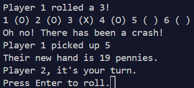

# The Penny Game

Welcome to **The Penny Game**, a fun and strategic dice-based game brought to life in Python. Inspired by a classic tabletop game, this project combines luck and strategy to keep players engaged. 

---

## Table of Contents
1. [Introduction](#introduction)
2. [Description](#description)
3. [How to Play](#how-to-play)
4. [The Evolution of The Penny Game](#the-evolution-of-the-penny-game)
5. [Features](#features)
6. [Testing](#testing)
7. [Issues](#issues)
8. [Next Steps](#next-steps)
9. [Feedback and Contribution](#feedback-and-contribution)
10. [Installation and Setup](#installation-and-setup)
11. [License](#license)

---

## Introduction
The Penny Game is a digital adaptation of a dice-based party game. Players compete to strategically place pennies on a shared board without causing a crash. This project showcases concepts in Python programming such as object-oriented design, user input handling, and randomness.

---

## Description
The Penny Game is designed for 2-5 players, including optional AI-controlled opponents. Each turn, players roll dice to place pennies into numbered slots on the board. The game ends when a player successfully gets rid of all their pennies.

This Python implementation replicates the joy of the physical game while allowing for flexible configurations and replayability.

---

## How to Play
1. **Start the Game:** Run the `game.py` script in a Python environment.
2. **Set Up Players:** Follow the prompts to input the number of human and COM players.
3. **Take Turns:** Roll dice to place your pennies into the board slots.
4. **Avoid Crashes:** Strategically manage your rolls to avoid overloading any slot, which triggers a crash.
5. **Win the Game:** The first player to empty their hand of pennies is declared the winner.

### Example Gameplay:
```
Welcome to The Penny Game!
Player 1 rolls a 3 and places a penny in slot 3.
Player 2 rolls a 5 and places a penny in slot 5.
Oh no! Player 1 caused a crash!
```

### Placeholder for Gameplay Screenshots:



---

## The Evolution of The Penny Game
This project started as a simple implementation of dice mechanics and grew into a full-fledged game with:
- Dynamic crash detection
- Player-controlled and AI opponents
- Robust error handling for user input

---

## Features
- **Dice Rolling:** Realistic simulation of dice rolls.
- **Crash Mechanic:** Slots crash if overloaded, adding a layer of strategy.
- **AI Opponents:** Play solo or compete against AI-controlled players.
- **Replayability:** Reset the game and start over with a new configuration.


## Testing
Comprehensive testing ensures the game runs smoothly:
- Unit tests validate core functionality.
- Edge cases for user input and gameplay mechanics are handled.

To run tests:
```bash
python -m unittest discover tests
```

---

## Issues
Known issues:
- None reported at this time.

Feel free to report issues in the [GitHub Issues tab](https://github.com/the-eva-a/penny-game/issues).

---

## Next Steps
Planned enhancements:
1. Add a graphical user interface (GUI).

---

## Feedback and Contribution
We welcome your feedback and contributions! To contribute:
1. Fork the repository.
2. Create a new branch for your feature or bugfix.
3. Submit a pull request for review.

For feedback or questions, open a [GitHub Issue](https://github.com/the-eva-a/penny-game/issues).

---

## Installation and Setup
### Prerequisites
- Python 3.9 or higher

### Steps
1. Clone the repository:
   ```bash
   git clone https://github.com/the-eva-a/penny-game.git
   ```
2. Navigate to the project directory:
   ```bash
   cd penny-game
   ```
3. Run the game:
   ```bash
   python game.py
   ```

---

## License
This project is licensed under the MIT License. See the [LICENSE](LICENSE) file for details.

---

Enjoy playing The Penny Game and feel free to reach out for any questions or suggestions!
